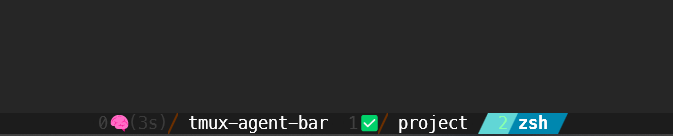

# tmux-agent-bar

tmux 윈도우 이름 앞에 이모지를 붙여 Claude Code 에이전트 상태를 한눈에 확인하는 도구.



## 개요

여러 tmux 윈도우/pane에서 Claude Code 에이전트를 동시에 실행할 때, 별도의 상태 바를 추가하지 않고 **기존 tmux 윈도우 이름 앞에 이모지를 삽입**하여 상태를 표시한다.

| 상태      | 표시 예시       | 의미                              |
| --------- | --------------- | --------------------------------- |
| 오류      | `🚨`            | 뭔가 문제가 생김 (최우선)         |
| 승인 대기 | `💬`            | 사용자 승인을 기다리는 중         |
| 처리 중   | `🧠(12s)`       | Claude가 thinking/작업 중 (경과 시간) |
| 완료      | `✅`            | 작업 완료                         |
| 없음      | ` `             | idle (Claude 없음 또는 대기 없음) |

`status-left`에는 창번호와 현재 디렉토리가 각각 다른 배경색 세그먼트로 표시된다.
`status-right`에는 Claude Code 활성 시 컨텍스트 사용률+모델이 별도 세그먼트로, 날짜와 시간이 하나의 세그먼트로 표시된다.

## 설치 및 실행

```bash
# 빌드 (Go 1.18+ 필요)
go build -o tmux-agent-bar .
```

`~/.tmux.conf`에 추가:

```
set -g status-interval 1
set -g window-status-format "#(tmux-agent-bar status #{window_index})#I #W"
set -g window-status-current-format "#(tmux-agent-bar status #{window_index})#I #W"

# status-left: [창번호|노랑-초록] [디렉토리|회색]
set -g status-left "#[fg=colour16,bg=colour148,bold]  #I:#P #[fg=colour148,bg=colour241]<→>#[fg=colour231,bg=colour241] #{b:pane_current_path} #[fg=colour241,bg=colour234]<→>"
set -g status-left-length 40

# status-right: [ctx%+model|회색, Claude 활성 시] [날짜+시간|노랑-초록]
# claude-right가 비활성 시에도 날짜 세그먼트 진입 화살표를 출력함
set -g status-right "#(tmux-agent-bar claude-right #{pane_id})#[fg=colour241,bg=colour234]<←>#[fg=colour148,bg=colour241]  %m/%d  %R "
set -g status-right-length 60
```

또는 `tmux-agent-bar install` 명령으로 위 설정을 `~/.tmux.conf`에 자동 추가하고 Claude Code hooks도 `~/.claude/settings.json`에 등록할 수 있다.

`~/.claude/settings.json`에 추가:

```json
{
  "hooks": {
    "PreToolUse": [
      {
        "matcher": "",
        "hooks": [
          { "type": "command", "command": "tmux-agent-bar hook thinking" }
        ]
      }
    ],
    "Stop": [
      {
        "matcher": "",
        "hooks": [{ "type": "command", "command": "tmux-agent-bar hook done" }]
      }
    ],
    "Notification": [
      {
        "matcher": "",
        "hooks": [
          { "type": "command", "command": "tmux-agent-bar hook waiting" }
        ]
      }
    ],
    "SubagentStop": [
      {
        "matcher": "",
        "hooks": [
          { "type": "command", "command": "tmux-agent-bar hook subagent_stop" }
        ]
      }
    ]
  }
}
```

## 주요 기능

- tmux의 각 pane에서 실행 중인 Claude Code 프로세스 상태 감지
- 상태 이모지를 윈도우 이름 앞에 자동 삽입 (🚨 / 💬 / 🧠 / ✅)
- 🧠 상태에서 경과 시간(초) 표시 — 전체 요청 시작 기준으로 누적
- `status-left`: 창번호, hostname, 현재 디렉토리를 각각 다른 배경색 powerline 세그먼트로 표시
- `status-right`: Claude Code 활성 pane 포커스 시 컨텍스트 사용률(%) + 모델명 표시; 날짜·시간을 각각 다른 배경색 세그먼트로 구분
- 기존 tmux 레이아웃·설정 변경 없이 동작 (별도 상태 바 불필요)
- 완료(`✅`) 상태는 해당 윈도우를 활성화하면 자동으로 사라짐

## 여러 pane 상태 집계 규칙

하나의 윈도우에 여러 pane이 있을 때 표시 우선순위:

| 상황 | 표시 |
|------|------|
| 상태가 서로 다름 | 가장 높은 우선순위 상태 (`🚨 > 💬 > 🧠 > ✅ > idle`) |
| 모든 pane이 같은 상태 | `pane_last_activity` 기준 **마지막으로 활성화된 pane**의 상태 |

예시:
- pane 0: thinking (30초째), pane 1: idle → `🧠(30s)` 표시
- pane 0: thinking (30초째), pane 1: waiting → `💬` 표시 (waiting이 우선)
- pane 0: thinking (30초째), pane 1: thinking (5초째, 마지막 활성) → `🧠(5s)` 표시
